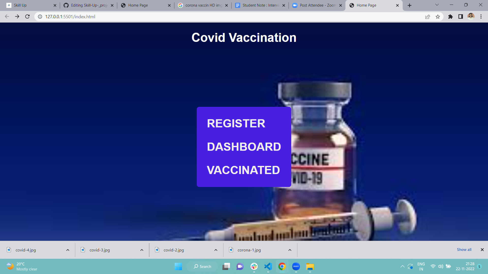

# Corona_vaccine

> Register or Sign In for Vaccination. An generate the random number OTP will be sent to your mobile number for verification. GET OTP. By Sign In/Registration, I agree to the Terms of then user can be entered in dashboard page and select the Name, Age, Designation, Priority, vaccine, information is submitted, if you have sucessfully vaccinted then your data strore be in our local storage.

## Built With

- javascript
- html
- css
- vercel
- github

## Live Demo 

[Netlify link available here]()

## Screenshots

### Setup
VS code , GitHub, vercel

## Authors

👤 **Priyanka Phulmante**

- GitHub: [@priyankaphulmante98](https://github.com/priyankaphulmante98)
